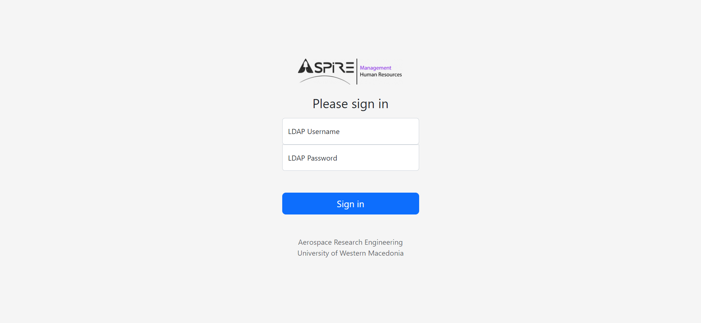
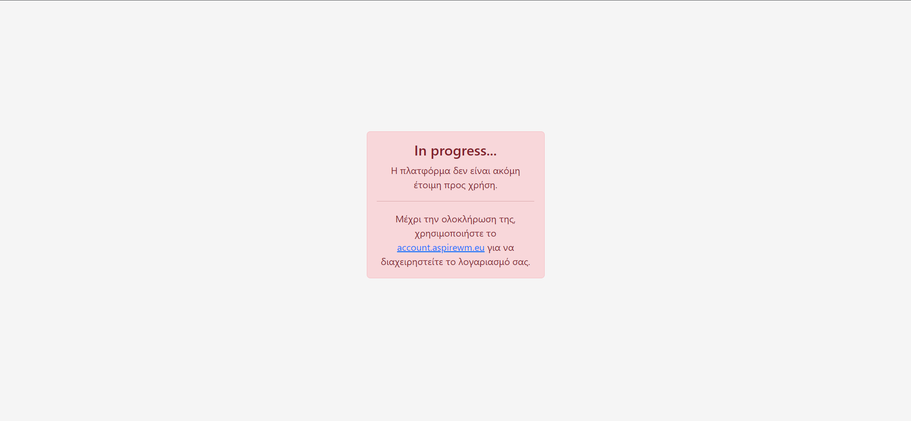
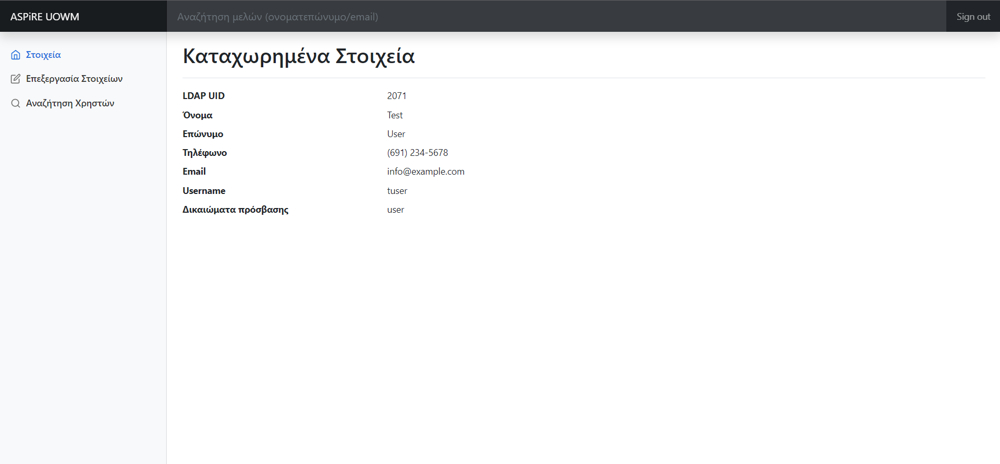
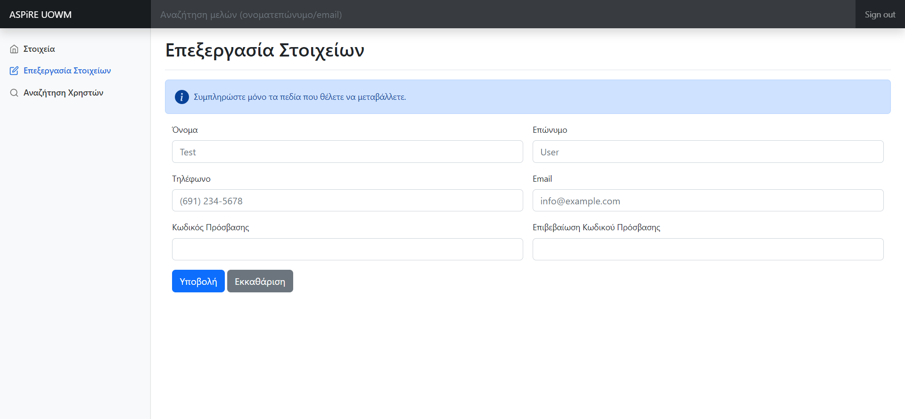
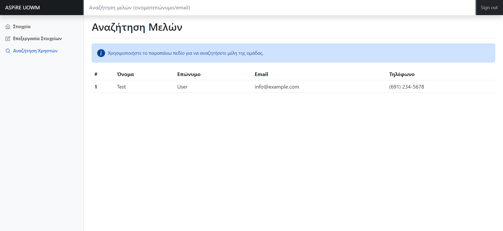
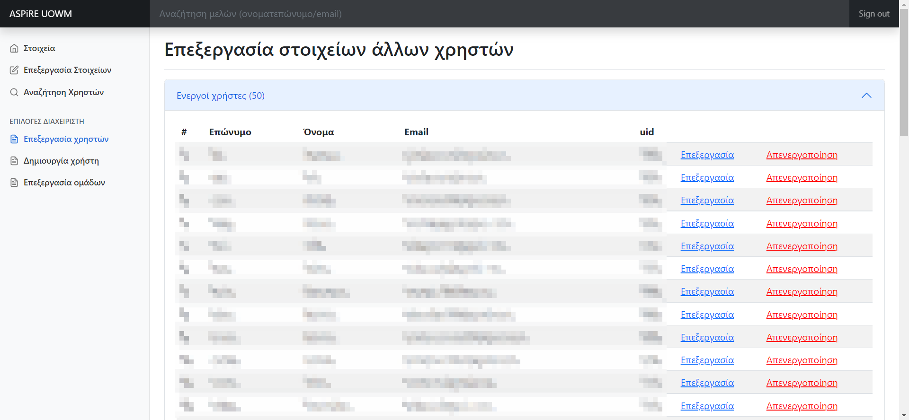
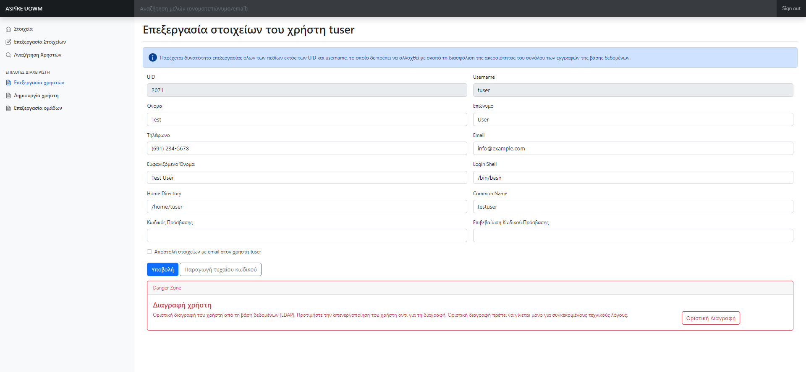
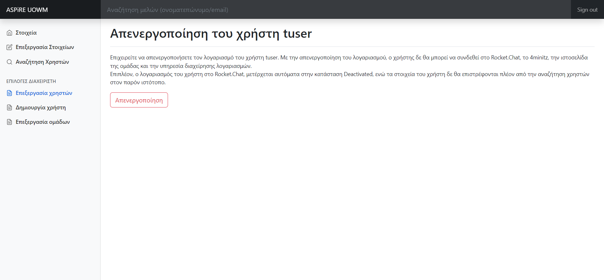
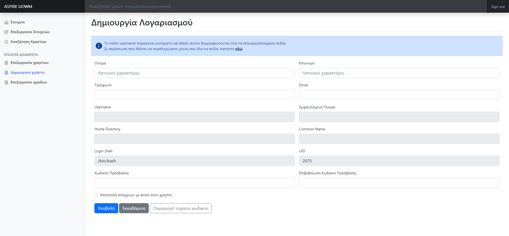
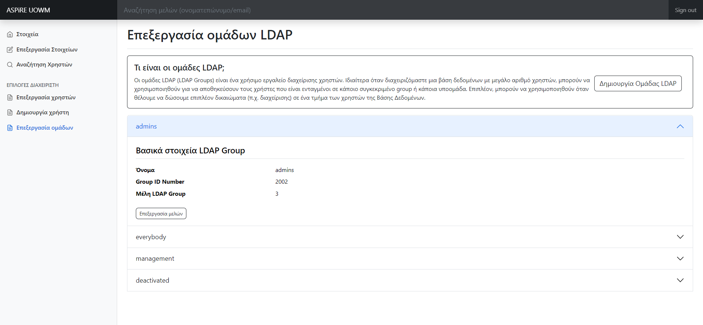

# LDAP Account Manager
A PHP application used for creating and modifying LDAP accounts.
The application was created as a Special Project under the supervision of [Dr. N. Ploskas](https://users.uowm.gr/nploskas) of the [Department of Electrical and Computer Engineering](https://ece.uowm.gr), [University of Western Macedonia](https://uowm.gr).

# Required software packages

In this section, there is detailed information relating to all software
packages (and even a library in the case of bootstrap) used to create
this project. This software is required for the successful compilation
of the code and to fulfill all its functions.

## Docker

Docker is a software package that uses virtualisation in order to
seclude pieces of software into their own containers. By doing that,
each one of them is able to run independently and without causing
problems to anything else running on that computer simultaneusly.\
In greater detail, after completing the coding process the software is
placed in a container, which, in essence, contains a very limited
edition of the required Operation System (sometimes, even programmes
packages expected in an OS are absent, most notably even nano can
sometimes be omitted from linux distributions). After that, all the
required packages for the installed product are installed, just like on
a physical computer (e.g. if a progamme requires MySQL, this must be
installed in the container). All this software is installed **only** in
the container and does no affect the rest of the Operation System in any
way. This approach, allows for pieces of software with conflicting
reqiuirements to be installed on the same system without causing any
kind of issue. All of the above are documented in an special kind of
file, called dockerfile, that has been prepared by the programmer and
entails all needed packages as well as where those must be installed.\
In the end, everything is stored on a *docker image* and are distributed
either via the programmers website (or for example github) or via Docker
Hub, which can best be described as a package manager for docker. All of
the above allow for the apps placed in a docker container to be platform
agnostic and run on any OS without issue.

### Docker images in use

In order to easily install and programatically manage an LDAP server,
instead of installing it on the computer itself (on bare metal) a docker
image with OpenLdap was preferred. The one chosen (and perhaps one of
the most popular ones) was docker-openldap (v 1.5.0) by osixia. This
image is freely available on Docker Hub and more information about it
can be found on [github](https://github.com/osixia/docker-openldap).

## OpenLDAP

OpenLDAP is a freely available, open source implementation of the
Lightweight Directory Access Protocol. More information about it can be
found on the official [OpenLDAP website](https://www.openldap.org).

## Bootstrap

Bootstrap is a powerful frontend toolkit that provides many necessary
tools to aleviate the burden of CSS programming that falls out the scope
of this project.

## Composer

Composer is a dependency manager for php. In combination with [private
packagist](https://packagist.com/) it allows the programmer to easily
install all required PHP dependencies that might prove useful for their
project. Composer is not a package manager per-se, but manages
\"packages\" (in essence PHP libraries) on a per-project bases. In this
particular project, composer was used for installing PHPMailer. More
information about composer can be found on its [official
website](https://getcomposer.org/).

### PHPMailer

PHPMailer is maybe the most used library for sending e-mail in PHP.
Since the SMTP server used for email communication resides on a
different machine, PHPMailer was the de facto solution to be used. More
information about is available on
[github](https://github.com/PHPMailer/PHPMailer).

## Code Breakdown

This section includes a general description of what each of the web apps
pages does, starting from the login page.\
The whole app is divided into two directories:

1.  login, which includes all files relevant to logging the user in and
    saving all required data for the app to operate into session
    variables and

2.  dashboard that contains all files needed to fulfill each of the
    operations that the app is capable of.

Each directory and its files are described below.

### Login

The login directory contains all files relative to the users
authentication as well as setting the session variables that prove that
the user has successfully authenticated. It consists of three files:
connect.php, index.php and no-access.php.

#### index.php

This page contains the login form for the app's users. After the user
fills the form, its data is posted to the **connect.php** script that
handles authentication. The script authenticates the user by attempting
to bind to the LDAP server. If it successfully binds, several attributes
from the users record on the database are saved as session variables.
The script also searches the groups that the user belongs to. This is
done using the memberOf attribute[^1]. If the user is a member of the
admins group, this is saved as a session variable. The reason this
happens will become apparent in the next sections of this guide.

#### no-access.php

This page provides a generic message for the users, when the app is down
for maintenance. A redirect to this page for all, or a group of users
can easily be activated from the connect.php script.

### Dashboard

After successfully authenticating using the connect script, the user is
redirected to the application dashboard. The dashboard contains all
files that allow the user to view the profile attributes saved on the
database and edit some of their own (in the case of regular users) or
all attributes of all users (in the case of administrators). A subset of
the following pages can be accessed by all users, while another may only
be accessed by administrators. The app's search function can be accessed
by all users from all the app's pages, thanks to the bootstrap template
that was used.

#### index.php

The page in question displays the users data as those are stored on the
database. Those are the UID number (which is required for the database
to adhere to the InetOrgPerson schema[^2], but **is not, in this case,
used as the account identifying attribute** - the UID[^3] was used for
that), the user's name (givenname LDAP attribute), surname (sn LDAP
attribute), email (mail attribute), username (UID attribute) and their
access level.

#### edit-user.php

This page allows the user to edit some of their own attributes. Those
are:

1.  Name (**givenName** attribute)

2.  Surname (**sn** attribute)

3.  Phone number (**phoneNumber** attribute)

4.  Email (**mail** attribute)

5.  Password (**userPassword** attribute).

By conjoining the first two attributes (with a space in between), the
app automatically generates the DisplayName attribute, that is used in
many services that access the database. Similarly, the CN[^4] attribute
is generated without the space. This is required for adherence to the
InetOrgPerson schema.

#### search.php

Even though a user can search for others from any page by using the
search bar on top, the results are always displayed in the search page.
This PHP script searches through all the database records using part (or
all) of the users name or email. Asterisks or similar characters for
displaying all users do not work in this field. Also, using an LDAP
filter in the search, users that are in an LDAP group called
*deactivated*, are not included in the results. The search function has
been configured to provide a member's name, surname, email and phone
number. It should be noted that, even though LDAP allows for multiple
attribute records in every available type, only the first result is
displayed (i.e. the one saved in the first row of the array, that is 0).

#### edit-users.php

*\
This page can only be accessed by people in the admin group*

This page displays all users saved on the database, broken into two
groups, active and deactivated ones. To achieve that without
unnecessarily cluttering the user's screen, a bootstrap accordion menu
was used. The attributes displayed (in order of appearance) are surname,
name, email and uid number. After them, the app displays two options,
one for editing all user attributes (with a blue link) and one that is
used to deactivate the user's account. Both of them are explained in
greater detail below.

#### edit-users-form.php

*\
This page can only be accessed by people in the admin group*

This page allows the administrators to edit any attribute of the user
they need. In order to safely edit fields, without compromising the
integrity of the database, the user cannot edit fields that are
structurally important to the database. Those are the UID number (that
must not conflict with any other saved on the database) as well as the
username (uid), as it is part of the user's DN (and that must be unique
to the user). The administrator is also able to completely remove the
record from the database, even though that should only be done in
extreme occasions. As stated on the web page, one should opt for
deactivation instead of deletion whenever possible.

#### deactivate.php

*\
This page can only be accessed by people in the admin group*

After choosing the deactivate link from the edit-users.php page, the
administrator is redirected to this page, on which they are asked to
confirm the deactivation. If this is done, the app places the user in
the *deactivated* LDAP group, and using APIs where they are available,
also deactivates the user's account in relevant services. For example,
in the code provided, the REST API of Rocket.Chat[^5] is utilized, to
deactivate the user's account on that platform, however any available
API can be added on the page's code.

*Note: there is a corresponding page for enabling a disabled users
account. That page executes the exact same code, just for the opposite
reason. Visually it is only differentiated from this one with a green
button instead of a red one.*

#### create-account.php

*\
This page can only be accessed by people in the admin group*

This page is used to create a new account/record on the database for new
users. The administrator types in the users name, surname, phone number
and email and all disabled fields are automatically generated based on
the **username**. That consists of the first letter of the user's name
and their whole surname. The user's **display name** contains both their
name and surname with a space between, the **CN** is the exact same
thing but without the space, the **home directory** consists of
\"/home/\" conjoined with the username in the end, **login shell**[^6]
which, in our case, is always \"/bin/bash\" and UID, which adds one to
the attribute saved in lastUID to avoid generating a **UID** number that
already exists in the database (after the script is executed, this
lastUID in incremented by one as well, since that does not happen
automatically in LDAP).\
Regarding the new user's **password**, that can either be set manually,
or generated automatically by using the third button. This is the safest
option, since it allows the generation a secure, random password, that
is the emailed to the user if the relevant option is checked. By using
that way, the password is not known to the admin. It is also worth
noting that the password are hashed before being saved on the server.

*Note: in order to avoid any issues with the auto-populated fields, the
app provides a seperate page, where all fields are editable by the user.
**This should only be used by experienced users, since its incorrect use
can irrevocably harm the database and its entries**.*

#### edit-groups.php

*\
This page can only be accessed by people in the admin group*

Edit-groups.php allows for the creation, deletion and modification of
LDAP Groups[^7]. In greater detail, administrators can create new
groups, delete any of the existing ones (except for admins, everybody
and deactivated which are required for the operation of this app) and
add or remove users from any group.

*Note: Due to an LDAP limitation, a group **must** be created with at
least one user and **cannot** at any time have less than one users. To
circumvent that, the app automatically includes the user that created a
group to it. That user can later be removed after others have been
added.*

## Templates and Licenses

### Bootstrap Template

The CSS template used for both the dashboard and login pages is provided
by bootstrap as an example. Both of them can be found on the [bootstrap
5.2 website](https://getbootstrap.com/docs/5.2/examples/).\
The template is offered under the [MIT
License](https://github.com/twbs/bootstrap/blob/main/LICENSE) and all
creators are credited in the source code of every page, **that code has
not been altered in any way**, in accordance with the license.

[^1]: RFC 2307BIS schema: In order to use the memberOf attribute, the
    RFC 2307BIS schema **must** be enabled on the LDAP Server, it is not
    enabled by default. More info about the schema, as well as the
    official memo can be found
    [here](https://datatracker.ietf.org/doc/draft-howard-rfc2307bis/).

[^2]: RFC 2798: this schema created the InetOrgPerson (Internet
    Organizational Person) structural element, which defines the
    attributes needed to *\"define a person object class that meets the
    requirements found in today's Internet and Intranet directory
    service deployments\"* according to the Network Working Group's
    [official memo](https://datatracker.ietf.org/doc/html/rfc2798).

[^3]: UID: User ID

[^4]: CN: Connected Name

[^5]: Rocket.Chat: one of the most popular open source messaging
    applications. More on Rocket.Chat can be found on its [official
    website](https://rocket.chat).

[^6]: Home directory and login shell: those fields are populated to
    achieve server compatibility with Linux based systems, that require
    those two attributes for LDAP authentication.

[^7]: LDAP Groups: beyond the obvious use of grouping users, further
    uses of this function, as well as information about it can be found
    on the [LDAP wiki website](https://ldapwiki.com/wiki/LDAP%20Group).
